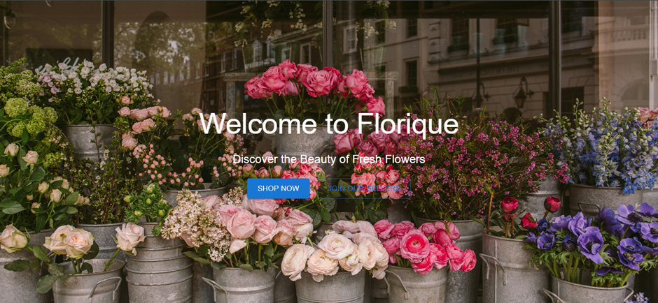
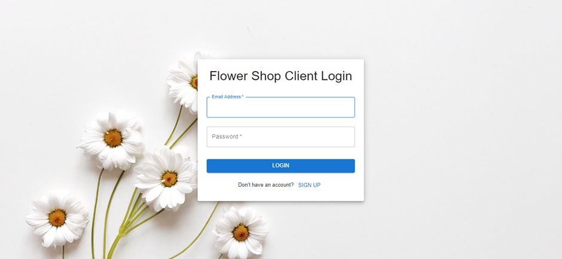
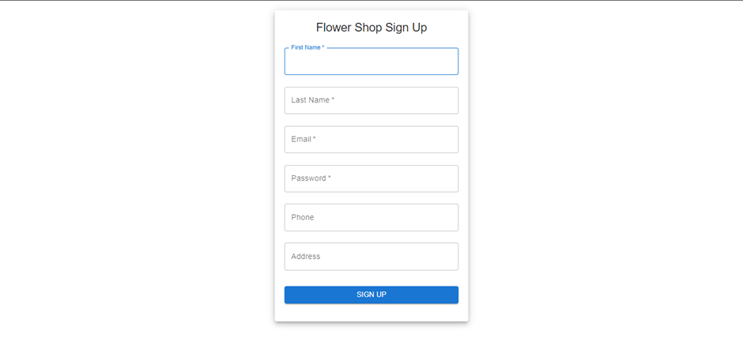
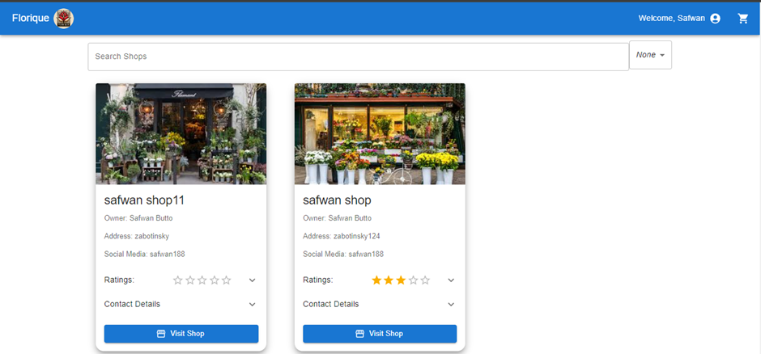
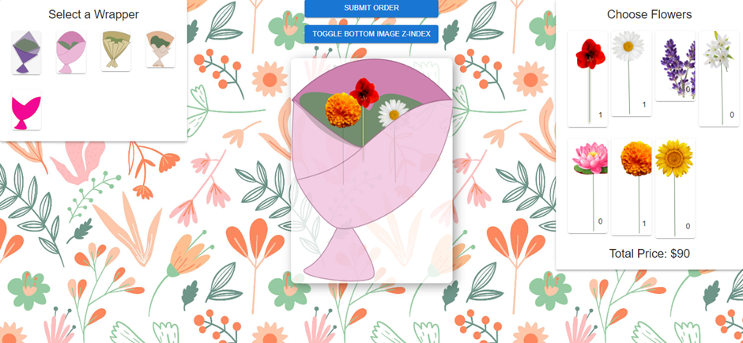
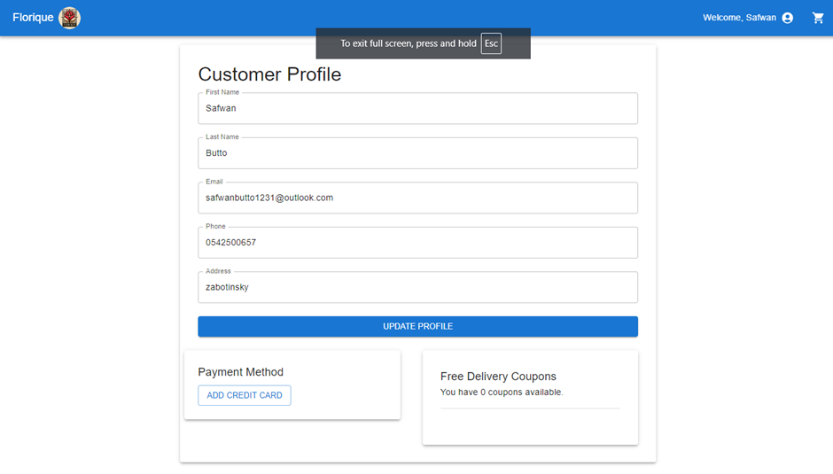
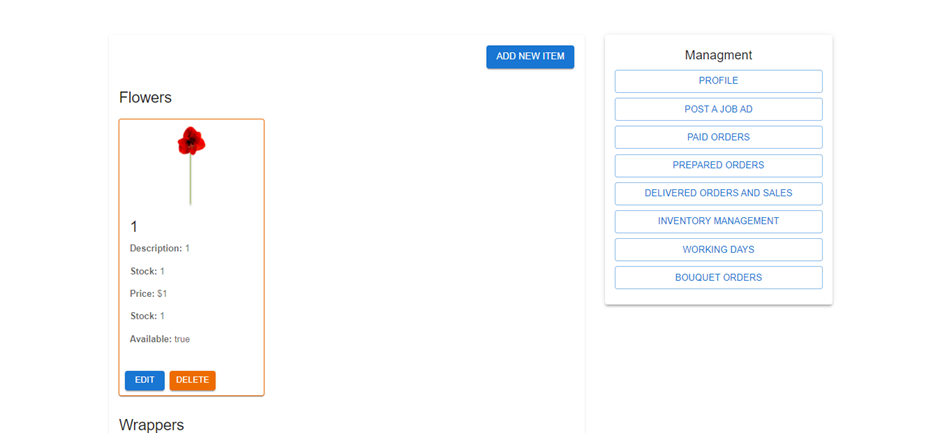
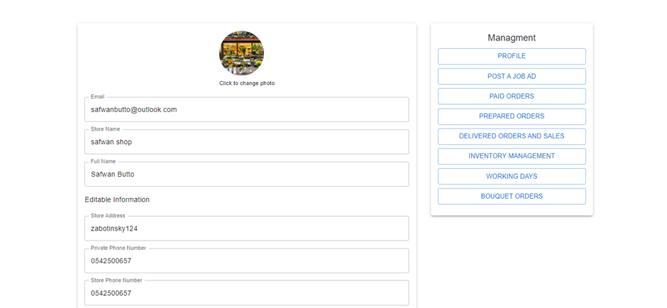

---

# Florique

Florique is an e-commerce web application for managing flower shops. This project is built using React and Material-UI (MUI) to create a user-friendly interface for both customers and shop owners.

## Table of Contents

- [Installation](#installation)

- [Screenshots](#screenshots)

## make sure to setup your firebase service file in services folder in src 

## Installation

To run this project locally, follow these steps:

1. **Clone the repository:**

   ```sh
   git clone https://github.com/safwan188/MUI_React_FlowerShop
   ```

2. **Navigate to the project directory:**

   ```sh
   cd florique
   ```

3. **Install dependencies:**

   ```sh
   npm install
   ```

4. **Start the development server:**

   ```sh
   npm start
   ```


### Home Page

The home page provides an introduction to Florique and encourages users to start shopping or join as a seller.

### Order Management

Shop owners can view and manage their orders, updating their status from 'paid' to 'prepared.'

### Shop Listings

Users can browse through different flower shops, view their ratings, and contact details. They can also visit the shop's page for more information.

### Sign Up

New flower shops can sign up by providing necessary details such as name, email, password, phone number, and address.

### Custom Order Creation

Customers can select flowers and wrappers to create a custom bouquet and submit their order.

### Customer Profile

Customers can update their profile information and manage their payment methods.

## Components

- **Home:** Main landing page.
- **Order Management:** Displays and manages orders.
- **Shop List:** Lists all the flower shops.
- **Sign Up Form:** Form for new shops to sign up.
- **Order Form:** Form for creating custom orders.
- **Profile:** Displays and updates customer profile information.

## Screenshots


*Welcome to Florique*



*Sign In Page*


*Sign Up Page*


*Shop Listings Page*
### creating customer bouqet using  react drag and drop

*Custom Order Creation Page*


*Customer Profile Page*



*Shop Inventory Page*


*Shop Owner Profile Page*


---

Feel free to replace placeholder text (like `yourusername` and `your-feature`) with your actual details and features specific to your project.
